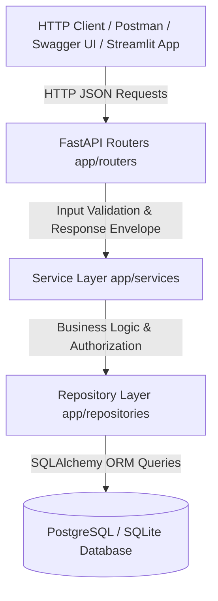

# ⚡ TaskFlow API & Work Management Platform

[](https://github.com/HARIHRITHIK/taskflow-api/actions/workflows/ci.yml)
[](https://taskflow-api.streamlit.app/)


> **TaskFlow** is a production-grade Python REST API and workflow execution platform engineered with **FastAPI**, **PostgreSQL / SQLite**, **SQLAlchemy ORM**, **Alembic**, and **Docker**. It implements strict 3-tier layered architecture, OWASP-recommended security controls, rate-limiting, comprehensive automated test coverage, and real-time operational telemetry.

---

## 🏗️ Architecture & Technical Design

TaskFlow API enforces a strict **3-Tier Layered Architecture** (`Router -> Service -> Repository`) to decouple HTTP handling, business logic, and database persistence.



### Technical Design Decisions
- **Repository Pattern (`app/repositories/`):** Isolates all SQLAlchemy ORM operations and database queries, enabling zero-database unit testing and clean persistence layer decoupling.
- **Service Layer (`app/services/`):** Encapsulates domain logic, tenant isolation, and transactional integrity outside the HTTP layer.
- **Alembic Migrations (`alembic/`):** Version-controlled, deterministic database schema evolution for production deployments.
- **Argon2id Password Security (`app/core/security.py`):** Utilizes OWASP-recommended Argon2id password hashing for robust ASIC/GPU brute-force resistance.
- **Soft Deletion (`is_deleted`):** Preserves data auditability and historical integrity without destructive database drops.
- **Pydantic Settings (`app/core/config.py`):** Fails fast at startup if required environment variables are absent or malformed.

---

## ⚡ Quickstart & Local Execution

### Option 1: Run Interactive Work Management Dashboard
```bash
streamlit run streamlit_app.py
```
👉 Launches the live TaskFlow Web UI at `http://localhost:8501`.

### Option 2: Run FastAPI Backend with Docker Compose
```bash
docker-compose up --build
```
- Interactive Swagger UI: `http://localhost:8000/docs`
- ReDoc UI: `http://localhost:8000/redoc`
- Operational Telemetry: `http://localhost:8000/api/v1/system/stats`

### Option 3: Local Python Setup
```bash
# 1. Create and activate virtual environment
python -m venv .venv
.\.venv\Scripts\activate  # On Linux/macOS: source .venv/bin/activate

# 2. Install dependencies
pip install -r requirements.txt

# 3. Seed demo data
python backend/scripts/seed.py

# 4. Start ASGI server
cd backend
python -m uvicorn app.main:app --reload --port 8000
```

---

## 🧪 Automated Testing & Quality Assurance

The repository includes a comprehensive automated test suite testing authentication, tenant isolation, search, filtering, and validation:

```bash
pytest -v backend/tests
```

---

## 🔌 API Endpoint Specifications

| HTTP Method | Route | Description | Auth Required |
| :--- | :--- | :--- | :---: |
| `GET` | `/health` | Liveness probe for container orchestrators | ❌ |
| `GET` | `/ready` | Database connection pool readiness check | ❌ |
| `GET` | `/version` | Engine version and metadata | ❌ |
| `GET` | `/api/v1/system/stats` | Real-time system telemetry and throughput metrics | ❌ |
| `POST` | `/api/v1/auth/register` | User account registration | ❌ |
| `POST` | `/api/v1/auth/login` | OAuth2 password login issuing JWT bearer token | ❌ |
| `POST` | `/api/v1/tasks/` | Create prioritized work item | ✅ |
| `GET` | `/api/v1/tasks/` | Paginated work item query (Search, Filter, Sort) | ✅ |
| `GET` | `/api/v1/tasks/{id}` | Retrieve single task by ID | ✅ |
| `PUT` | `/api/v1/tasks/{id}` | Update task attributes and status | ✅ |
| `DELETE` | `/api/v1/tasks/{id}` | Soft-delete work item | ✅ |

---

## 📬 Postman Integration

Import [`docs/TaskFlow_API.postman_collection.json`](docs/TaskFlow_API.postman_collection.json) into Postman for instant end-to-end API verification.

---

## 🛡️ License

Distributed under the **MIT License**.
