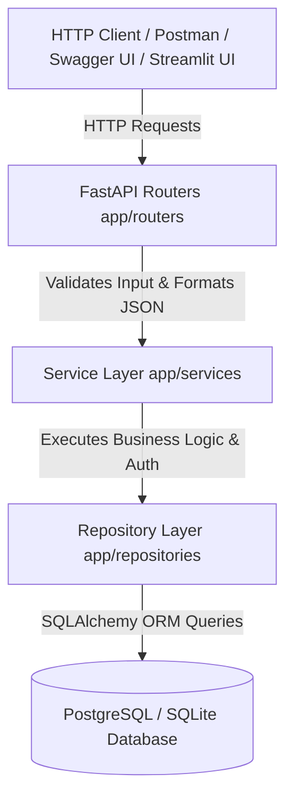

# ⚡ TaskFlow API Platform

[](https://github.com/HARIHRITHIK/taskflow-api/actions/workflows/ci.yml)
[](https://taskflow-api.streamlit.app/)


> **TaskFlow API** is a production-inspired Python REST API and Work Management Platform demonstrating how modern backend services are designed, secured, tested, documented, and deployed. Built with **FastAPI**, **PostgreSQL / SQLite**, **SQLAlchemy ORM**, **Alembic**, **Docker**, and an interactive **Streamlit Dashboard**, it showcases clean 3-tier architecture, security controls, and operational observability.

---

## ❓ Why This Project Exists (Problem Statement)

Most portfolio backend projects stop at basic CRUD functionality and fail to demonstrate production-inspired engineering practices such as layered architecture, authentication security, database schema migrations, automated testing, containerization, operational health probes, and professional documentation.

**TaskFlow API** was created to bridge that gap by demonstrating how a clean, maintainable, production-inspired REST API backend can be engineered using modern Python practices while remaining lightweight, easy to run, and easy to explain.

### 🌟 Portfolio Synergy
**TaskFlow API** acts as the foundational backend service in my portfolio, complementing my AI products:
- 🤖 **AI Hiring Assistant**
- 📊 **AI Business Intelligence Studio**
- 🔍 **Clarity**
- ⚡ **TaskFlow API** *(Core Backend & Work Execution Engine)*

---

## 📐 System Architecture

TaskFlow API enforces a strict **3-Tier Layered Architecture** (`Router -> Service -> Repository`) to decouple HTTP handling, business logic, and database access.



---

## 📚 Engineering Concepts Demonstrated

- ✅ **REST API Design & Versioning:** Enveloped JSON pagination, status codes, and `/api/v1/` prefixing.
- ✅ **JWT Authentication & Security:** OAuth2 bearer token flows with OWASP-recommended **Argon2id** password hashing.
- ✅ **Layered 3-Tier Architecture:** Decoupled Router, Service, and Repository modules.
- ✅ **Dependency Injection:** Declarative database session and auth resolution via FastAPI `Depends`.
- ✅ **SQLAlchemy & Alembic Migrations:** Version-controlled database schema evolution.
- ✅ **Automated Testing Suite:** Isolated, in-memory SQLite Pytest suite covering Auth, Authorization, CRUD, and Validation.
- ✅ **Operational Observability:** Liveness (`/health`), Readiness (`/ready`), Version (`/version`), and System Metrics (`/api/v1/system/stats`).
- ✅ **Rate Limiting & CORS:** API protection via `slowapi` rate limiters and configurable CORS middleware.
- ✅ **Containerization & CI/CD:** Single-stage `Dockerfile`, `docker-compose.yml`, and GitHub Actions CI workflow.
- ✅ **Interactive Streamlit Web Dashboard:** One-click visual interface for recruiters and interviewers (`streamlit run streamlit_app.py`).

---

## 💡 Architectural Justification Framework (Interview Q&A)

| Architectural Decision | Rationale & Engineering Justification | 2-Minute Technical Interview Pitch |
| :--- | :--- | :--- |
| **Repository Pattern** | Decouples ORM queries from domain logic. | *"It isolates SQLAlchemy queries in data access repositories, making it effortless to mock database calls in unit tests without spinning up a live DB."* |
| **Service Layer** | Keeps routers thin and HTTP-focused. | *"Routers handle HTTP request parsing and response codes; services encapsulate business logic, permissions, and database transaction boundaries."* |
| **Alembic Migrations** | Version-controlled schema evolution. | *"Instead of dangerous `create_all()` calls, Alembic tracks schema changes in versioned Python scripts, ensuring safe schema rollbacks and production compatibility."* |
| **Argon2 Password Hashing** | OWASP-recommended password security. | *"Argon2id won the Password Hashing Competition and provides superior resistance to GPU/ASIC brute-force attacks compared to legacy bcrypt."* |
| **Soft Deletion (`is_deleted`)** | Auditability and data recovery. | *"Real-world applications preserve data integrity and allow recovery by flagging records as deleted rather than executing immediate hard deletes."* |
| **Pydantic Settings** | Centralized environment validation. | *"Validates environment variables at startup, failing fast if mandatory keys like `SECRET_KEY` or `DATABASE_URL` are missing."* |

---

## ⚡ Quickstart Guide

### Option 1: Run Interactive Streamlit Dashboard (Recruiter Demo)
```bash
# Launch interactive Streamlit Web UI
streamlit run streamlit_app.py
```
- Opens the TaskFlow Interactive Dashboard at `http://localhost:8501`

### Option 2: Run FastAPI Backend with Docker Compose (1 Command)
```bash
# Spin up FastAPI API + PostgreSQL Database
docker-compose up --build
```
- Interactive Swagger Documentation: `http://localhost:8000/docs`
- Health Probe: `http://localhost:8000/health`
- Operational Metrics Dashboard: `http://localhost:8000/api/v1/system/stats`

### Option 3: Local Python Virtual Environment Setup
```bash
# 1. Clone Repository & Navigate
git clone https://github.com/HARIHRITHIK/taskflow-api.git
cd taskflow-api

# 2. Create & Activate Virtual Environment
python -m venv .venv
source .venv/bin/activate  # On Windows: .venv\Scripts\activate

# 3. Install Dependencies
pip install -r requirements.txt

# 4. Run Database Seeder (Creates Demo Admin User & Sample Tasks)
python backend/scripts/seed.py

# 5. Launch FastAPI ASGI Server
cd backend
python -m uvicorn app.main:app --reload --port 8000
```

---

## 🧪 Running Automated Tests

The repository includes a comprehensive Pytest suite executing against an in-memory SQLite database:

```bash
cd backend
python -m pytest -v
```

---

## 🔌 API Endpoint Reference

| Method | Endpoint | Description | Auth Required |
| :--- | :--- | :--- | :---: |
| `GET` | `/health` | Liveness Probe | ❌ |
| `GET` | `/ready` | Database Readiness Probe | ❌ |
| `GET` | `/version` | Service Version Information | ❌ |
| `GET` | `/api/v1/system/stats` | Operational System Metrics Dashboard | ❌ |
| `POST` | `/api/v1/auth/register` | Register New User Account | ❌ |
| `POST` | `/api/v1/auth/login` | Authenticate & Obtain JWT Access Token | ❌ |
| `POST` | `/api/v1/tasks/` | Create New Task | ✅ |
| `GET` | `/api/v1/tasks/` | List Tasks (Search, Filter, Sort, Paginate) | ✅ |
| `GET` | `/api/v1/tasks/{id}` | Retrieve Single Task by ID | ✅ |
| `PUT` | `/api/v1/tasks/{id}` | Update Task Attributes | ✅ |
| `DELETE` | `/api/v1/tasks/{id}` | Soft-Delete Task | ✅ |

---

## 📬 Postman Collection

Import `docs/TaskFlow_API.postman_collection.json` into Postman for instant 1-click API testing with pre-configured endpoints and request payloads.

---

## 🚀 Future Enhancements Roadmap

- 📩 **Email Verification & Password Reset Flows**
- 🔄 **JWT Refresh Token Rotation & Blacklisting**
- 📎 **Task File Attachments (AWS S3 / Cloud Storage Integration)**
- 👥 **Team Workspaces & Role-Based Access Control (RBAC)**
- 🔔 **Audit Logging & Activity Streams**

---

## 🛡️ License

Distributed under the **MIT License**.
