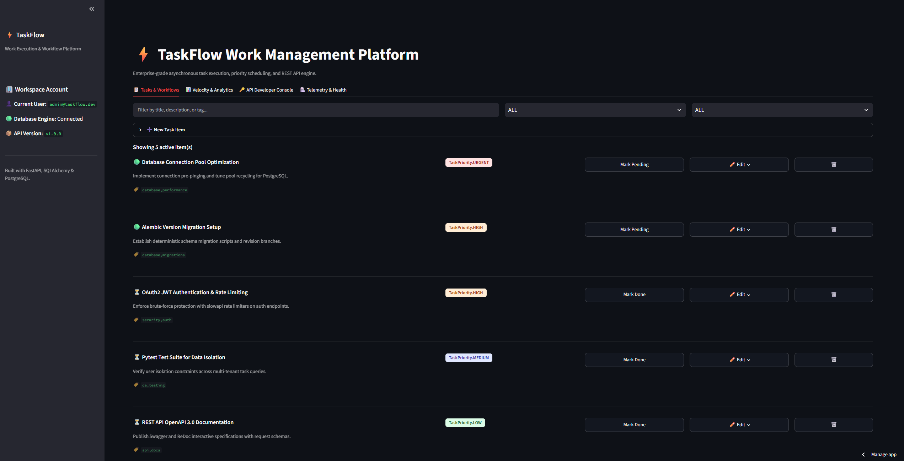
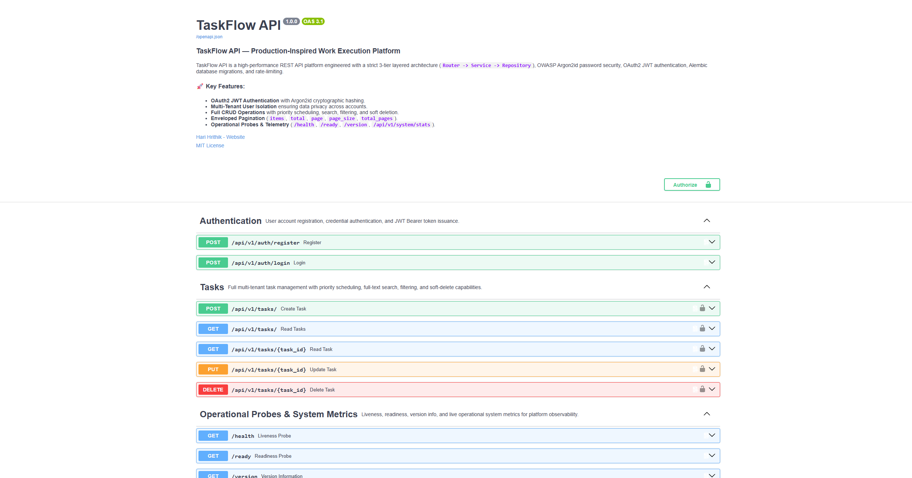
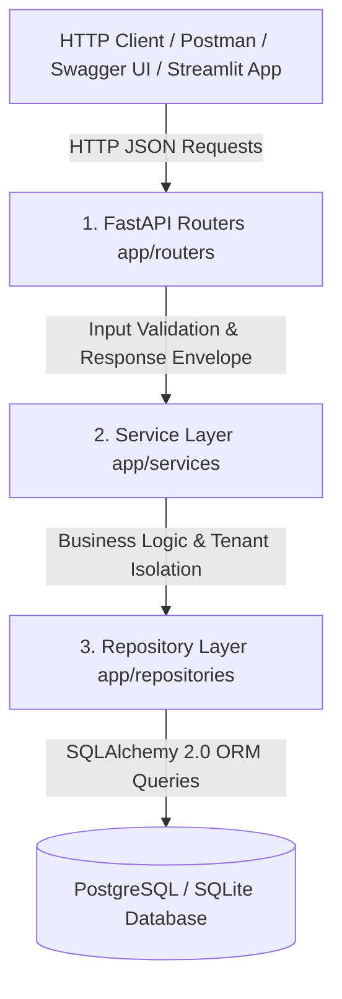
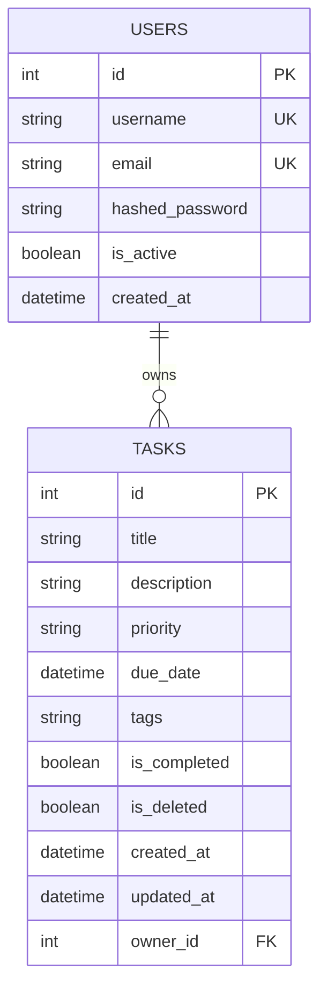
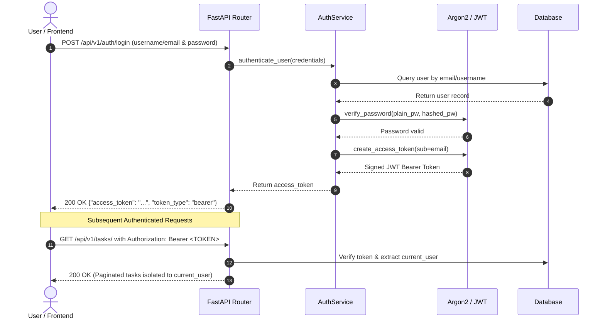

# TaskFlow API

A production-inspired Python REST API and workflow execution platform engineered with FastAPI, PostgreSQL/SQLite, SQLAlchemy ORM, Alembic migrations, and Docker.

[](https://github.com/HARIHRITHIK/taskflow-api/actions/workflows/ci.yml)


---

## 🚀 Live Demo

> **Live Demo:** [taskflow-api.streamlit.app](https://taskflow-api.streamlit.app/)

Explore the live, interactive **TaskFlow Work Management Platform** web interface featuring real-time task creation, inline editing, search, priority filtering, and operational telemetry.

---

## 📚 API Documentation

> **Interactive API Docs (Local & Docker):** Available at [http://127.0.0.1:8000/docs](http://127.0.0.1:8000/docs)

Interactive OpenAPI 3.0 documentation allowing developers to inspect request schemas, test authentication, and execute live API calls.

---

## 📸 Preview





---

## Problem

Most backend projects stop at basic CRUD tutorials, exhibiting critical engineering deficiencies:
- **Tightly Coupled Layers:** Direct database queries embedded inside web route handlers.
- **Outdated Password Security:** Reliance on legacy hashing algorithms vulnerable to modern GPU brute-force attacks.
- **Unversioned Databases:** Reliance on unsafe `create_all()` calls that cannot safely alter or migrate production databases.
- **Zero Automated Testing:** Lack of automated test suites and continuous integration pipelines.
- **Missing Observability:** Absence of health probes (`/health`, `/ready`) and operational telemetry.

---

## Solution

**TaskFlow API** implements an industry-standard **3-Tier Layered Architecture** (`Router -> Service -> Repository`), OWASP-recommended **Argon2id** password hashing, stateless **OAuth2 JWT** authentication, version-controlled **Alembic** schema migrations, comprehensive **Pytest** test automation with **GitHub Actions CI**, and an interactive **Streamlit Web Dashboard**.

---

## Features

- ⚡ **Strict 3-Tier Layer Separation:** Clean isolation between HTTP routing, domain business logic, and database persistence.
- 🔐 **OWASP Argon2id Password Security:** Memory-hard cryptographic hashing resistant to GPU and ASIC brute-force attacks.
- 🎫 **OAuth2 JWT Authentication:** Stateless bearer token authorization with configurable expiration claims.
- 🛡️ **Brute-Force Rate Limiting:** `SlowAPI` token-bucket rate limiters safeguarding `/auth/login` and `/auth/register`.
- 👥 **Multi-Tenant User Isolation:** Automatic tenant isolation ensuring users can only read, update, or soft-delete their own records.
- 📋 **Prioritized Work Scheduling:** Tasks support `URGENT`, `HIGH`, `MEDIUM`, and `LOW` priority classifications.
- 🔍 **Full-Text Search & Dynamic Filtering:** Real-time substring query matching across titles, descriptions, and tags.
- 📦 **Enveloped Metadata Pagination:** Standardized responses returning `items`, `total`, `page`, `page_size`, and `total_pages`.
- 🗑️ **Auditable Soft Deletion:** Preserves historical data integrity and recovery without destructive SQL deletions.
- 🏥 **Operational Probes & Telemetry:** Liveness (`/health`), readiness (`/ready`), and real-time system metrics (`/api/v1/system/stats`).
- 🧪 **Automated Test Suite:** Pytest test suite executed against isolated in-memory SQLite databases.

---

## Architecture

TaskFlow API enforces clean separation of concerns across three distinct tiers:



For an in-depth architectural breakdown of design patterns, data flow, and dependency injection, see [docs/ARCHITECTURE.md](docs/ARCHITECTURE.md).

---

## Security

TaskFlow API adopts a defense-in-depth security model:
1. **Password Hashing:** Utilizes **Argon2id** (`argon2-cffi`), the winner of the Password Hashing Competition (PHC) and OWASP-recommended standard.
2. **Stateless Authorization:** Issues signed JWT tokens using HMAC-SHA256 (`HS256`).
3. **Endpoint Rate Limiting:** Enforces `10 requests/minute` per remote client IP on sensitive authentication routes.
4. **Environment Isolation:** Validates environment variables at startup using `pydantic-settings`, failing fast if production secrets are missing or insecure.

---

## Database Design

The relational database schema is modeled in SQLAlchemy 2.0 with indexed primary keys and foreign key relationships:



- **Schema Evolution:** Managed through version-controlled **Alembic** migration scripts (`backend/alembic/versions/`).
- **Connection Reliability:** Connection pre-pinging (`pool_pre_ping=True`) prevents stale connections across connection pool recycling.

---

## API Reference

| HTTP Method | Route | Description | Authentication |
| :--- | :--- | :--- | :---: |
| `GET` | `/health` | Liveness probe verifying ASGI process health | Public |
| `GET` | `/ready` | Readiness probe verifying live database connection | Public |
| `GET` | `/version` | Returns service name and version identifier | Public |
| `GET` | `/api/v1/system/stats` | Real-time system telemetry and throughput metrics | Public |
| `POST` | `/api/v1/auth/register` | Register a new user account (Argon2id hashed) | Public |
| `POST` | `/api/v1/auth/login` | Authenticate credentials and issue JWT Bearer Token | Public |
| `POST` | `/api/v1/tasks/` | Create a prioritized task item | Bearer JWT |
| `GET` | `/api/v1/tasks/` | Query paginated tasks (Search, Filter, Sort) | Bearer JWT |
| `GET` | `/api/v1/tasks/{id}` | Retrieve a single task by ID | Bearer JWT |
| `PUT` | `/api/v1/tasks/{id}` | Update task title, description, priority, or status | Bearer JWT |
| `DELETE` | `/api/v1/tasks/{id}` | Soft-delete a task item | Bearer JWT |

---

## Authentication Flow



---

## Testing

TaskFlow API includes an automated Pytest test suite executed against an isolated in-memory SQLite database:

```bash
# Run all unit and integration tests
pytest -v backend/tests
```

### Verified Test Cases:
- ✅ `test_register_user_success` — Verifies user registration and password hashing.
- ✅ `test_register_duplicate_email` — Validates email uniqueness constraints.
- ✅ `test_register_duplicate_username` — Validates username uniqueness constraints.
- ✅ `test_login_success` — Verifies authentication and JWT token generation.
- ✅ `test_login_invalid_credentials` — Confirms 401 Unauthorized on invalid passwords.
- ✅ `test_create_task_authenticated` — Verifies task creation under valid bearer auth.
- ✅ `test_create_task_unauthenticated` — Blocks unauthenticated requests.
- ✅ `test_user_isolation` — Verifies User A cannot read, update, or delete User B's tasks.
- ✅ `test_search_and_filter_tasks` — Tests substring queries and priority filtering.
- ✅ `test_soft_delete_task` — Validates soft deletion and active query exclusion.

---

## CI/CD

Continuous integration is automated via **GitHub Actions** ([`.github/workflows/ci.yml`](.github/workflows/ci.yml)):
- Automatically triggers on every `push` and `pull_request` to `main`.
- Sets up Python 3.11 with pip dependency caching.
- Executes `ruff check` for linting and code hygiene.
- Executes the full `pytest` test suite with coverage reporting.

---

## Docker

TaskFlow API is containerized using a clean, reproducible `Dockerfile` and `docker-compose.yml`:

```bash
# Launch FastAPI API + PostgreSQL Database in isolated containers
docker-compose up --build
```
- API Container: `http://localhost:8000`
- PostgreSQL Container: `localhost:5432` with automated container health checks.

---

## Local Setup

### Prerequisites
- Python 3.11+
- Git

### 1. Clone Repository & Setup Virtual Environment
```bash
git clone https://github.com/HARIHRITHIK/taskflow-api.git
cd taskflow-api

# Create & activate virtual environment
python -m venv .venv
.\.venv\Scripts\activate  # Linux/macOS: source .venv/bin/activate

# Install dependencies
pip install -r requirements.txt
```

### 2. Run Database Migrations & Seed Sample Data
```bash
# Apply migrations
cd backend
alembic upgrade head

# Seed initial admin user and demo tasks
python scripts/seed.py
```
*(Creates demo user `admin@taskflow.dev` / `TaskFlowDemo123!` and realistic sample work items).*

### 3. Launch Interactive Work Management Dashboard
```bash
cd ..
streamlit run streamlit_app.py
```
👉 Access dashboard at `http://localhost:8501`.

### 4. Launch FastAPI Backend Server
```bash
cd backend
python -m uvicorn app.main:app --reload --port 8000
```
👉 Access Swagger UI at `http://127.0.0.1:8000/docs`.

---

## Deployment

The platform is deployment-ready for free cloud platforms:

- **Streamlit Community Cloud:** Point `share.streamlit.io` to repository `HARIHRITHIK/taskflow-api` with main file `streamlit_app.py`.
- **Render / Railway (FastAPI):** Configured via root [`Procfile`](Procfile) using `uvicorn app.main:app --app-dir backend --host 0.0.0.0 --port ${PORT:-8000}`.

---

## Technical Decisions

| Decision | Rationale & Engineering Justification |
| :--- | :--- |
| **Repository Pattern** | Decouples SQLAlchemy ORM queries from business services, enabling fast, isolated unit testing without requiring a live database. |
| **Service Layer** | Keeps HTTP routers lightweight while encapsulating business rules, tenant isolation, and transaction management in reusable services. |
| **Alembic Migrations** | Provides deterministic, version-controlled database schema changes, avoiding dangerous unversioned table creation in production. |
| **Argon2id Hashing** | Recommended by OWASP as the superior memory-hard password hashing algorithm resistant to GPU-accelerated brute-force attacks. |
| **Soft Deletion (`is_deleted`)** | Preserves historical auditability and data recovery while seamlessly filtering out deleted records from user queries. |
| **Pydantic Settings** | Validates environment variables at application startup, failing fast if mandatory configuration keys are missing. |

---

## Limitations

- **Single-Node Rate Limiting:** Current rate limiting uses an in-memory token bucket suitable for single-node deployments. Distributed multi-instance deployments would require an external state store (such as Redis).
- **Access-Token Only Model:** Currently implements short-lived JWT access tokens without refresh token rotation.

---

## Future Improvements

- 🔄 **JWT Refresh Token Rotation & Blacklisting:** Implementing short-lived access tokens paired with revocable refresh tokens.
- 📎 **Task File Attachments:** S3-compatible cloud object storage integration for work item attachments.
- 👥 **Team Workspaces & RBAC:** Role-based access control supporting organization workspaces and granular permissions.
- 🔔 **Activity Audit Logs & Webhooks:** Event streams recording administrative actions and external webhook dispatches.

---

## License

Distributed under the **MIT License**. See [LICENSE](LICENSE) for details.
