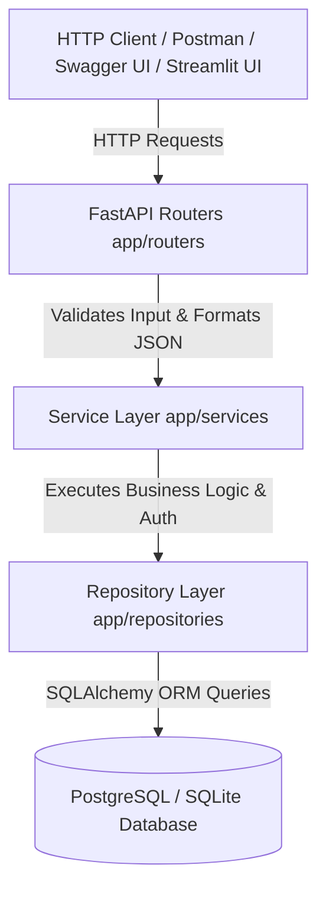

# ⚡ TaskFlow API Backend Service

[](https://github.com/HARIHRITHIK/taskflow-api/actions/workflows/ci.yml)
[](https://taskflow-api.streamlit.app/)


> **TaskFlow API** is a production-inspired Python REST API platform demonstrating how modern backend services are designed, secured, tested, documented, and deployed. Built with **FastAPI**, **PostgreSQL / SQLite**, **SQLAlchemy ORM**, **Alembic**, and **Docker**, it showcases clean 3-tier architecture, security controls, and operational observability.

---

## 📐 System Architecture



---

## ⚡ Quickstart Guide

```bash
# 1. Run Database Seeder (Creates Demo Admin User & Sample Tasks)
python scripts/seed.py

# 2. Launch FastAPI ASGI Server
uvicorn app.main:app --reload --port 8000
```

- Interactive Swagger Documentation: `http://localhost:8000/docs`
- Operational Metrics Dashboard: `http://localhost:8000/api/v1/system/stats`

---

## 🧪 Running Automated Tests

```bash
python -m pytest -v
```
