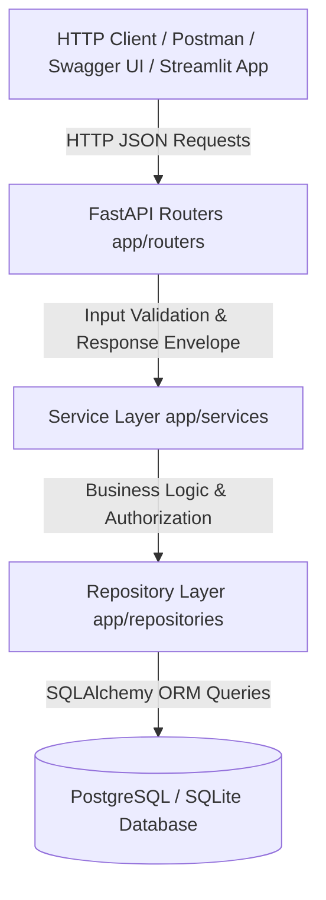

# ⚡ TaskFlow API Backend Engine

[](https://github.com/HARIHRITHIK/taskflow-api/actions/workflows/ci.yml)
[](https://taskflow-api.streamlit.app/)


> **TaskFlow** is a production-grade Python REST API and workflow execution platform engineered with **FastAPI**, **PostgreSQL / SQLite**, **SQLAlchemy ORM**, **Alembic**, and **Docker**.

---

## 🏗️ Architecture



---

## ⚡ Quickstart

```bash
# Run seeder
python scripts/seed.py

# Start ASGI server
uvicorn app.main:app --reload --port 8000
```
