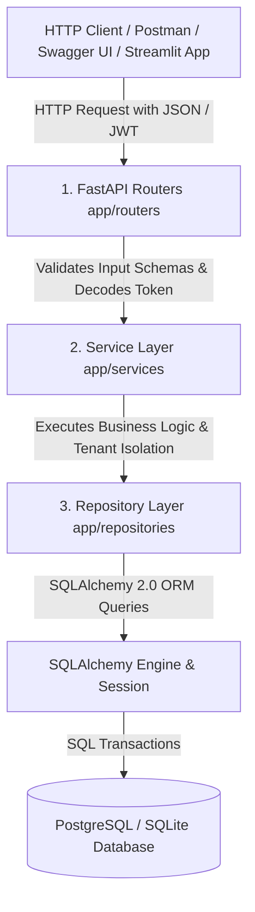
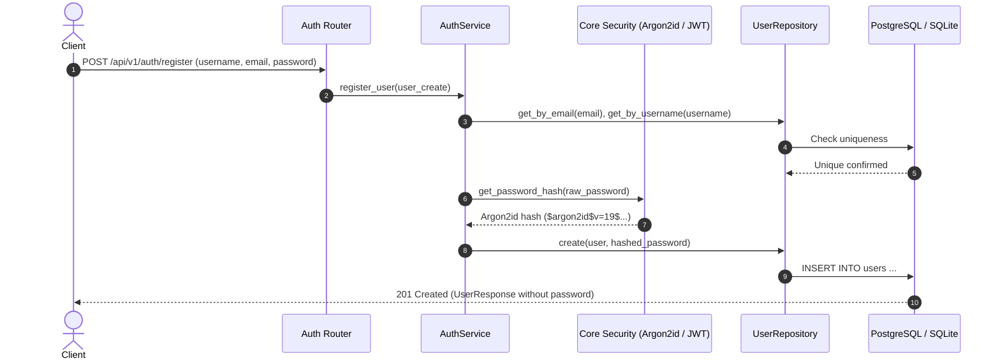
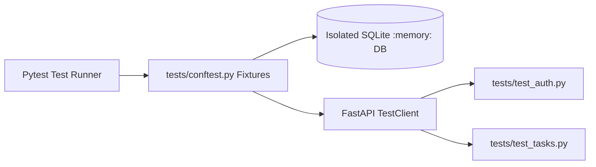

# 🏛️ TaskFlow API — System Architecture & Design Specification

This document provides a comprehensive technical overview of the architecture, design patterns, security mechanisms, and data access strategies implemented in the **TaskFlow API** platform.

---

## 📐 High-Level Architecture Flow

TaskFlow API is built on a strict **3-Tier Layered Architecture** that completely decouples the HTTP transport layer from business logic and database persistence:

---

## 🧩 Architectural Layers & Responsibilities

### 1. Presentation & Routing Layer (`app/routers/`)
- **Files:** `auth.py`, `tasks.py`, `system.py`
- **Responsibilities:**
  - Defines versioned REST endpoints (`/api/v1/`).
  - Validates inbound HTTP payloads using strict Pydantic v2 schemas (`TaskCreate`, `TaskUpdate`, `UserCreate`).
  - Serializes and formats HTTP responses into enveloped metadata schemas (`PaginatedTaskResponse`, `TaskResponse`).
  - Maps domain exceptions to standard HTTP status codes (`200`, `201`, `400`, `401`, `404`, `503`).
  - Enforces endpoint rate limiting via `@limiter.limit()`.
- **Constraint:** Routers contain **zero raw database queries** (`db.query()`) and zero business validation rules.

### 2. Domain & Service Layer (`app/services/`)
- **Files:** `auth_service.py`, `task_service.py`
- **Responsibilities:**
  - Coordinates domain workflows and business rules.
  - Enforces **User/Tenant Isolation** (e.g., verifying `owner_id` to ensure users can only read, update, or soft-delete their own records).
  - Handles credential authentication and password verification.
  - Generates signed JWT access tokens with expiration claims.
  - Assembles enveloped pagination metadata (`total`, `page`, `page_size`, `total_pages`).

### 3. Data Access & Repository Layer (`app/repositories/`)
- **Files:** `user_repository.py`, `task_repository.py`
- **Responsibilities:**
  - Encapsulates all database interactions and SQLAlchemy ORM operations (`query()`, `filter()`, `add()`, `commit()`, `refresh()`).
  - Constructs optimized SQL queries with substring search (`ilike`), priority filters, status filters, and dynamic column sorting (`order_by`).
  - Implements the soft-delete mutation (`soft_delete()`) that sets `is_deleted = True`.

---

## 🔒 Security & Cryptography Architecture

### 1. Argon2id Password Hashing (`app/core/security.py`)
- **Algorithm:** Argon2id (v19) configured via `passlib[argon2]`.
- **Why Argon2id?** Argon2id won the Password Hashing Competition (PHC) and is the current OWASP recommendation. Unlike older algorithms (MD5, SHA-256, or basic bcrypt), Argon2id is *memory-hard*, making it computationally prohibitive to crack using GPU or ASIC brute-force clusters.

### 2. Stateless OAuth2 JWT Authentication (`app/dependencies.py`)
- **Algorithm:** HMAC-SHA256 (`HS256`) via `python-jose`.
- **Token Claims:** Payload embeds the subject identifier (`sub: email`) and UTC expiration timestamp (`exp`).
- **Dependency Injection:** The `get_current_user` dependency automatically extracts the Bearer token from the `Authorization: Bearer <TOKEN>` header, validates the signature, and retrieves the active user entity per request.

### 3. Brute-Force Rate Limiting (`app/core/limiter.py`)
- **Engine:** `SlowAPI` token-bucket rate limiter.
- **Rule:** `10 requests / minute` per remote client IP applied to `/api/v1/auth/login` and `/api/v1/auth/register` to mitigate credential stuffing and dictionary attacks.

---

## 🗄️ Database Architecture & Migrations

### 1. Database Schema
- **`users` Table:**
  - `id` (Integer, Primary Key, Indexed)
  - `username` (String, Unique, Indexed)
  - `email` (String, Unique, Indexed)
  - `hashed_password` (String)
  - `is_active` (Boolean, Default: True)
  - `created_at` (DateTime with TimeZone)
- **`tasks` Table:**
  - `id` (Integer, Primary Key, Indexed)
  - `title` (String, Indexed)
  - `description` (String, Nullable)
  - `priority` (String: `LOW`, `MEDIUM`, `HIGH`, `URGENT`, Indexed)
  - `due_date` (DateTime with TimeZone, Nullable)
  - `tags` (String, Nullable)
  - `is_completed` (Boolean, Default: False)
  - `is_deleted` (Boolean, Indexed, Default: False)
  - `created_at` (DateTime with TimeZone)
  - `updated_at` (DateTime with TimeZone)
  - `owner_id` (Integer, Foreign Key $\rightarrow$ `users.id`)

### 2. Schema Lifecycle with Alembic (`alembic/`)
- Instead of using unversioned `Base.metadata.create_all()`, production schema changes are tracked in versioned migration scripts (`backend/alembic/versions/001_initial_schema.py`).
- `alembic/env.py` dynamically synchronizes with `pydantic-settings` to connect to PostgreSQL or SQLite.

### 3. Soft Deletion Pattern
- Rather than executing hard SQL `DELETE FROM tasks WHERE id = ?`, TaskFlow sets `task.is_deleted = True`.
- All standard read queries automatically filter `Task.is_deleted == False`, preserving auditability while ensuring clean end-user views.

---

## 🧪 Testing & Quality Architecture

- **Isolation:** Tests run against a fast, in-memory SQLite database (`sqlite:///:memory:`) using SQLAlchemy's `StaticPool`.
- **Dependency Overrides:** `conftest.py` overrides `get_db` during test runs, ensuring the development database is never touched or polluted.
- **Coverage:** 10 targeted automated tests covering:
  - User registration success and duplicate handling (email & username).
  - Login authentication and invalid credential rejection.
  - Authenticated vs unauthenticated task creation.
  - Multi-tenant **User Isolation** (verifying User A cannot read, update, or delete User B's tasks).
  - Substring search, priority filtering, and soft deletion.
